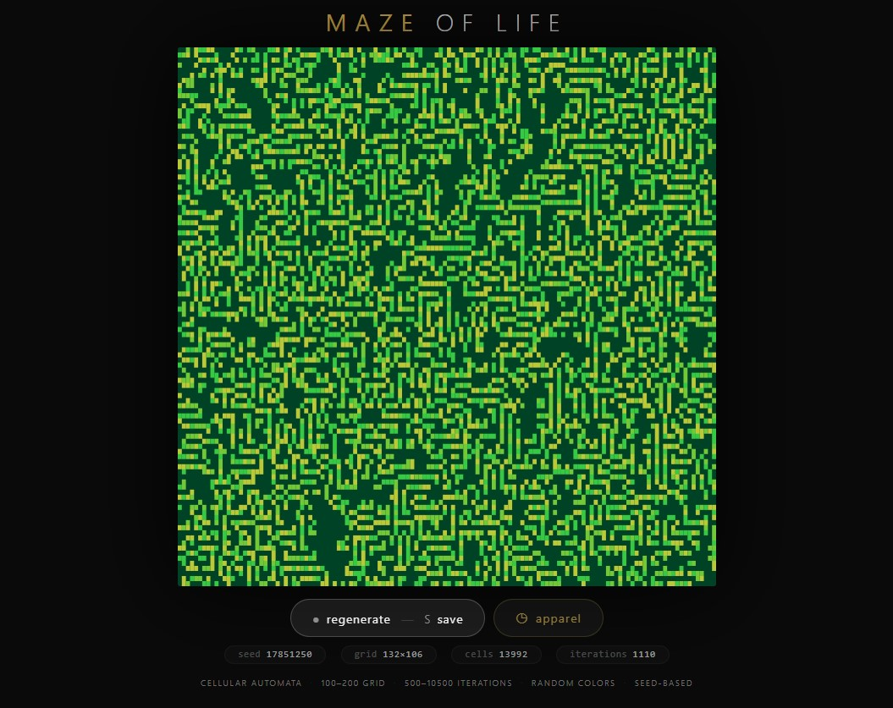
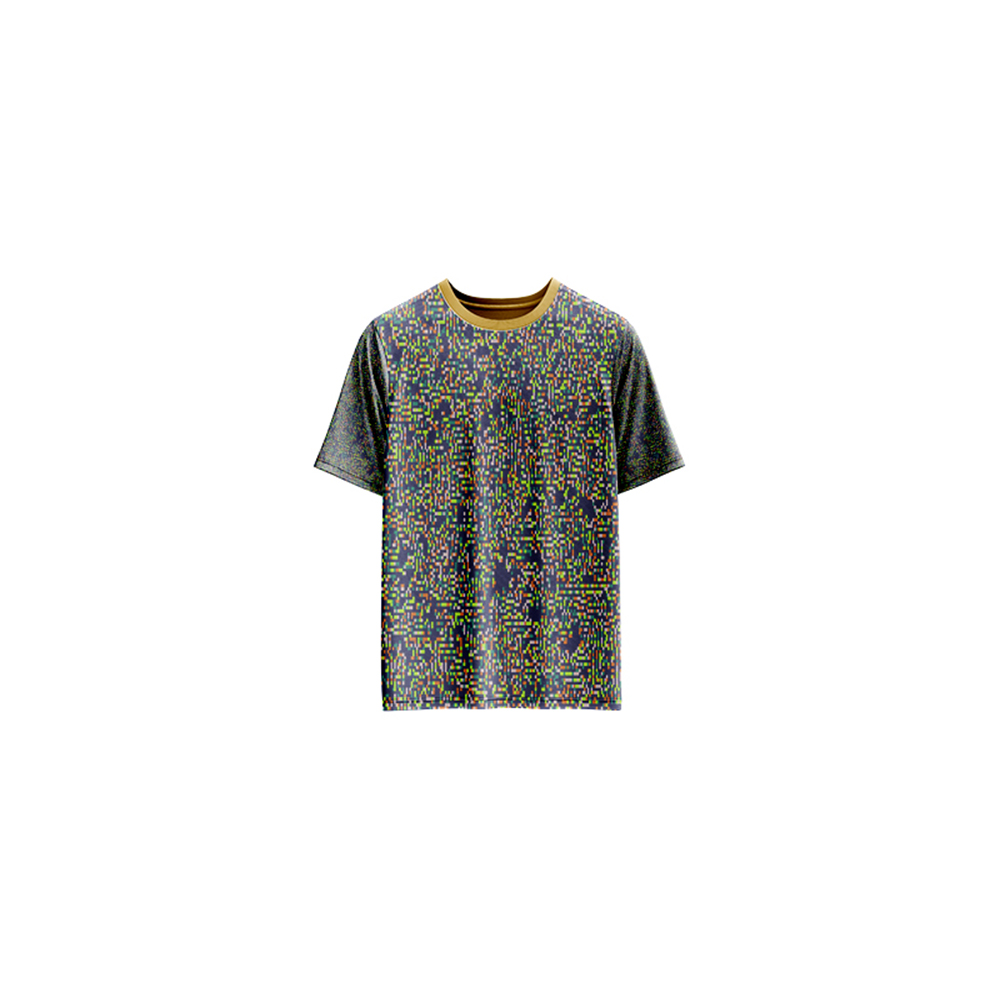

# Maze of Life — Generative Art

[](https://reyrove.github.io/Maze-of-Life-Generative-Art)
[](https://opensource.org/licenses/MIT)

> **Generative cellular automata art.** Each refresh creates a unique maze-like pattern using Conway's Game of Life with random colors, densities, and iterations.

## 🎨 Live Demo

<div align="center">
  <a href="https://reyrove.github.io/Maze-of-Life-Generative-Art" target="_blank">
    
  </a>
  <br><br>
  <a href="https://reyrove.github.io/Maze-of-Life-Generative-Art" target="_blank">
    
  </a>
  <br>
  <em>Click the image or button to experience the generative art</em>
</div>

## 👕 Apparel Preview

<div align="center">
  
  <br>
  <em>Maze of Life artwork printed on a T-shirt</em>
</div>

## ✨ Features

- **Conway's Game of Life** — Classic cellular automaton simulation
- **Maze-like Patterns** — Organic, labyrinthine structures
- **Random Density** — 40-90% initial cell density
- **Rich Color Palettes** — 43 vibrant color combinations
- **Dark Backgrounds** — 27 dark, moody colors
- **Variable Iterations** — 500-10,500 evolution steps
- **Large Grid** — 100-200 cells per dimension
- **Seed-Based** — Every composition is unique and reproducible via its seed
- **Save & Share** — Download as PNG with seed in filename
- **Apparel Mode** — Preview artwork on a T-shirt mockup
- **Responsive** — Works on desktop, tablet, and mobile
- **Pure JavaScript** — No external dependencies
- **Keyboard Shortcuts**:
  - `R` — Regenerate
  - `S` — Save image
  - `T` — Toggle apparel view

## 🎨 Artwork Details

| Parameter | Range | Description |
|-----------|-------|-------------|
| **Grid Size** | 100×100 to 200×200 | Cell grid dimensions |
| **Initial Density** | 40–90% | Random live cells |
| **Iterations** | 500–10,500 | Evolution steps |
| **Background Colors** | 27 options | Dark, rich colors |
| **Foreground Palettes** | 43 options | Vibrant color combinations |
| **Total Cells** | 10,000–40,000 | Grid cells |

## 🧬 The Game of Life

Conway's Game of Life follows four simple rules:

1. **Underpopulation** — Any live cell with fewer than 2 live neighbors dies
2. **Survival** — Any live cell with 2 or 3 live neighbors lives on
3. **Overpopulation** — Any live cell with more than 3 live neighbors dies
4. **Reproduction** — Any dead cell with exactly 3 live neighbors becomes alive

Despite these simple rules, complex maze-like patterns emerge that are both fascinating and beautiful.

## 🚀 Quick Start

### Local Development

```bash
# Clone the repository
git clone https://github.com/reyrove/Maze-of-Life-Generative-Art.git

# Navigate to the directory
cd Maze-of-Life-Generative-Art

# Open in browser
open index.html
# or use a live server
```

### Deploy to GitHub Pages

1. Push to GitHub
2. Go to Settings → Pages
3. Select branch `main` and root folder
4. Your site will be live at `https://reyrove.github.io/Maze-of-Life-Generative-Art`

## 🧠 How It Works

The artwork is generated using a deterministic random number generator, seeded by timestamp + random noise. Every refresh:

1. **Setup**:
   - Random dark background from 27 colors
   - Random foreground palette from 43 options
   - Random grid size (100-200 cells)
   - Random initial density (40-90%)
   - Random iteration count (500-10,500)

2. **Simulation**:
   - Conway's Game of Life rules applied
   - Cells evolve for thousands of iterations
   - Maze-like patterns emerge

3. **Rendering**:
   - Dark background
   - Each live cell gets a random color from the palette
   - Rich, organic patterns

## 📁 File Structure

```
Maze-of-Life-Generative-Art/
├── index.html          # Main application (all-in-one)
├── Maze-of-Life.jpg    # T-shirt mockup image
├── fav.svg             # Favicon
├── demo-screenshot.jpg # Website demo screenshot
├── README.md           # This file
└── LICENSE             # MIT License
```

## 🛠️ Tech Stack

- **Pure Vanilla HTML/CSS/JS** — No dependencies
- **Canvas API** — 2D rendering
- **CSS Flexbox/Grid** — Responsive layout
- **GitHub Pages** — Hosting

## 🎯 Interactive Controls

| Action | Keyboard | Button |
|--------|----------|--------|
| Regenerate | `R` | Click "regenerate" |
| Save Image | `S` | Click "regenerate" |
| Toggle Apparel | `T` | Click "apparel" |

## 🎨 The Creative Process

### Maze Emergence
Starting from a random configuration, the Game of Life rules create organic, maze-like structures. The high density (40-90%) and thousands of iterations produce intricate, labyrinthine patterns.

### Color Palettes
43 carefully curated color palettes provide vibrant, harmonious color combinations. Each live cell gets a random color from the palette, creating rich, varied textures.

### Variable Density
The initial density varies between 40-90%, producing dramatically different patterns—from sparse, delicate structures to dense, complex mazes.

### Dark Backgrounds
27 dark, moody background colors provide a dramatic canvas for the colorful cell patterns.

## 📱 Responsive Design

The application automatically adapts to:
- Desktop screens
- Tablets
- Mobile phones
- Landscape orientation
- Various aspect ratios

## 🤝 Contributing

Contributions are welcome! Feel free to:
- Fork the repository
- Create a feature branch
- Submit a pull request

### Ideas for Contributions:
- New color palettes
- Different cellular automata rules
- Animation features
- Interactive controls
- Performance optimizations

## 📄 License

MIT License — see [LICENSE](LICENSE) file for details.

## 🙏 Acknowledgments

- Inspired by Conway's Game of Life
- Pure JavaScript implementation
- Special thanks to the creative coding community

---

**Built with ❤️ and cellular automata**